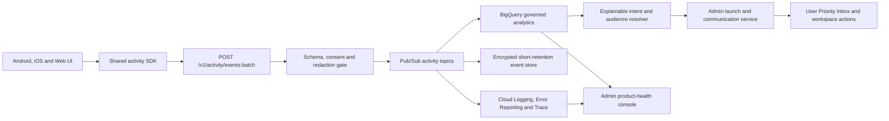

# MoolSocial User Activity, Product Health and Personalization Lock

Date: 13 July 2026

## Outcome

MoolSocial must know whether every production journey works, where a user is blocked, which release caused a failure and which lawful, relevant next action may help that user. This applies to personal consumers, retailers, manufacturers, suppliers, captains, creators, freelancers, providers, staff and Admin.

The platform records meaningful product actions and technical outcomes. It does not record indiscriminate screen video, raw touch coordinates, private content or secrets.

## Two Separate Purposes

### 1. Product health and support

- crashes, UI errors and API failures
- route, screen and action completion
- latency, offline, retry and timeout states
- release, device class, operating system and app version
- journey abandonment and validation failure
- trace from a reported problem to the responsible service

This purpose is operational. It must not silently become advertising data.

### 2. Consent-aware relevance

- product or service categories deliberately viewed
- searches expressed as structured intent, not unrestricted raw text
- offers opened, dismissed or completed
- eligible work viewed, saved, applied for or completed
- active workspace type and allowed service area
- frequency, recency and declared preferences

This purpose supports relevant offers, tasks, advertisements, features and work opportunities. Promotional targeting must respect notice, consent, withdrawal, suppression, quiet hours and frequency limits.

## Event Contract

Every meaningful control receives a stable `action_id`. All launch routes emit a versioned envelope:

```json
{
  "event_id": "01J...",
  "event_name": "action_completed",
  "schema_version": 1,
  "occurred_at": "2026-07-13T12:20:18.244Z",
  "actor_id": "usr_tokenized_id",
  "session_id": "ses_rotating_id",
  "screen_id": 81,
  "route_id": "retailer.wholesale",
  "route_state": "catalogue",
  "workspace_id": "wk_tokenized_id",
  "workspace_type": "retailer",
  "action_id": "wholesale.add_moq",
  "object_type": "catalogue_offer",
  "object_id": "obj_tokenized_id",
  "result": "success",
  "error_code": null,
  "latency_ms": 284,
  "trace_id": "trace_id",
  "app_version": "6.4.1",
  "device_class": "android_phone",
  "locale": "en-IN",
  "area_code": "coarse_service_area",
  "consent_version": "personalization-v3",
  "feature_flags": ["wholesale_matrix_v2"]
}
```

Allowed event names for MVP:

- `screen_opened`
- `action_presented`
- `action_tapped`
- `action_completed`
- `action_failed`
- `validation_failed`
- `screen_exited`
- `api_completed`
- `offline_state_changed`
- `crash_detected`
- `consent_changed`
- `communication_exposed`
- `communication_acted`

High-volume gestures, scrolls and playback progress are sampled and aggregated. They must not create an unbounded event stream.

## Never Enter the Activity Stream

- password, OTP, UPI PIN, CVV, payment token or authentication secret
- private Chat text, calls, attachments or contact book
- patient report content, prescription content or clinical notes
- Aadhaar number, PAN number, bank account number or unmasked statutory identifiers
- raw biometric image or face template
- unrestricted microphone, camera or screen recording
- exact continuous location history outside an active location-dependent service
- unrestricted search text, form free text or document content
- child profiling for advertising

Sensitive domain events may state only an allowed outcome such as `identity_verification_completed`, `payment_authorized` or `clinical_document_accessed`. The protected content remains in its authorized domain store.

## Client Instrumentation

1. UI components emit stable action IDs through one shared analytics SDK.
2. Route middleware emits screen and state transitions.
3. API clients attach `trace_id`, route, action and idempotency context.
4. Events are queued locally when offline, encrypted in transit, batched and retried.
5. The SDK removes forbidden fields before transmission.
6. Duplicate `event_id` values are ignored server-side.
7. Sampling and kill switches are remotely configurable by event class and app version.

Android, iOS and web use the same semantic registry. Platform-specific names must map to one canonical `action_id`.

## Full-Stack Flow



Recommended MVP GCP components:

- API Gateway or authenticated Cloud Run endpoint
- Pub/Sub for durable event ingestion and dead-letter handling
- Cloud Logging, Error Reporting, Monitoring and Trace for technical health
- BigQuery with partitioning, clustering, row-level access and policy tags
- Cloud Storage only for governed archive or dead-letter payloads
- Cloud KMS, Secret Manager and service-account isolation
- scheduled SQL or Dataform for MVP aggregates; Dataflow only when volume requires it

Operational events, analytics events and authoritative transaction records remain separate. BigQuery is not the source of truth for orders, money, rides, eligibility or consent.

## API Surface

- `POST /v1/activity/events:batch`
- `GET /v1/admin/product-health/summary`
- `GET /v1/admin/journeys/{journey_id}`
- `GET /v1/admin/users/{tokenized_user_id}/activity`
- `GET /v1/admin/traces/{trace_id}`
- `GET /v1/admin/segments`
- `POST /v1/admin/segments:estimate`
- `POST /v1/admin/segments`
- `POST /v1/admin/telemetry/policies`
- `POST /v1/admin/telemetry/kill-switch`
- `GET /v1/users/me/activity-preferences`
- `PUT /v1/users/me/activity-preferences`

Every Admin read requires role, purpose, case or reason, and audit metadata. Every Admin write requires idempotency, version checks and maker-checker approval where risk requires it.

## Core Data Models

- `activity_event`: immutable event envelope with tokenized actor and object IDs
- `event_schema`: allowed fields, sensitivity, owner, sampling and retention
- `journey_definition`: ordered screen, action and outcome states
- `journey_health_hourly`: success, failure, abandonment and latency aggregates
- `user_intent_signal`: explainable signal, source action, strength and expiry
- `audience_segment`: versioned rules, purpose, consent requirement and owner
- `consent_receipt`: notice, purpose, language, version, granted or withdrawn time
- `admin_access_audit`: actor, purpose, query, affected scope and result
- `telemetry_policy`: event enablement, sampling, masking, retention and kill switch
- `feature_flag_exposure`: flag version, variant and resulting journey health

## Product-Health Admin UX

Default view is aggregate health, not a list of people:

1. See journey success, crashes, API errors, latency and affected releases.
2. Open one anomaly to see screen, action, app version, device class and service trace.
3. Inspect an authorized tokenized user timeline only when support or incident work requires it.
4. Resolve the responsible code, API or configuration owner.
5. Verify recovery through canary health and affected-user outcomes.

Screen 163 is the `activity-health` state of `/admin`; it does not consume a new production route.

## Personalization Admin UX

1. Choose a lawful purpose such as offer, work, feature education or required action.
2. Start from an explainable intent signal or verified workspace eligibility.
3. Estimate audience after consent, suppression, frequency and risk rules.
4. Preview why a representative user is included or excluded.
5. Send the approved audience to Screen 156 for message, channel, approval and launch.
6. Monitor action, conversion, complaints, opt-outs and stop conditions.

Screen 164 is the `telemetry-governance` state of `/admin/configuration`; it does not consume a new production route.

## Admin Control Boundaries

Admin may:

- search aggregate health, journeys, tokenized users and traces
- pause a faulty feature or event class
- change sampling and retention within approved policy
- suppress unsafe or irrelevant targeting
- create explainable segments and communication drafts
- start support, verification, fraud or incident workflows
- view domain outcomes allowed by role

Admin may not:

- read private communications or protected domain content through analytics
- edit transaction history, money ledgers or completed evidence
- impersonate a user without a separately approved support workflow
- export raw audience or complete user-activity tables
- target users from sensitive clinical, biometric, religious or similarly protected inferences
- silently restore withdrawn promotional consent

“Full control” means every permitted control is available through an accountable domain command. It does not mean unrestricted database editing.

## Privacy, Consent and Retention

- show clear purpose-specific notices in supported Indian languages
- separate operational necessity from personalization consent
- make withdrawal as easy as consent
- stop future promotional processing after withdrawal and preserve required audit only
- use the shortest approved retention per event class
- rotate session IDs and tokenize stable identifiers
- support access, correction, erasure and grievance workflows as applicable
- perform a legal and security review before production launch

The implementation must be reviewed against the [Digital Personal Data Protection Act, 2023](https://www.meity.gov.in/writereaddata/files/Digital%20Personal%20Data%20Protection%20Act%202023.pdf), the [Digital Personal Data Protection Rules, 2025](https://www.meity.gov.in/documents/act-and-policies/digital-personal-data-protection-rules-2025-gDOxUjMtQWa) and the current [IT Rules, 2021](https://www.meity.gov.in/documents/act-and-policies/information-technology-intermediary-guidelines-and-digital-media-ethics-code-rules-2021-it-rules-2021-IjM5QjMtQWa). This file is an engineering contract, not legal advice.

## Production Acceptance

- every launch route and primary control has a registered `action_id`
- action success and failure can be traced from UI to responsible API
- forbidden-field tests fail the build when sensitive payloads are emitted
- duplicate, late and offline events are handled idempotently
- Admin aggregate health updates within the agreed operational latency
- authorized user timelines are tokenized, purpose-logged and audited
- targeting shows inclusion reason and respects withdrawal immediately
- event, feature and personalization kill switches are tested
- telemetry outage never blocks a consumer transaction or workspace operation
- synthetic tests cover login, Social, Buy, Eat, Ride, Book, Pay, Work, Chat and every MVP workspace shell
